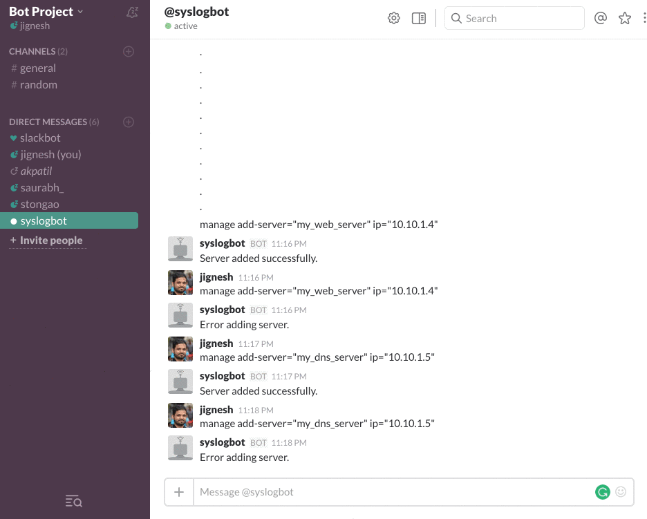
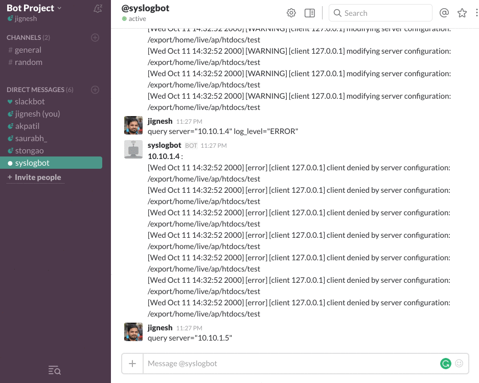
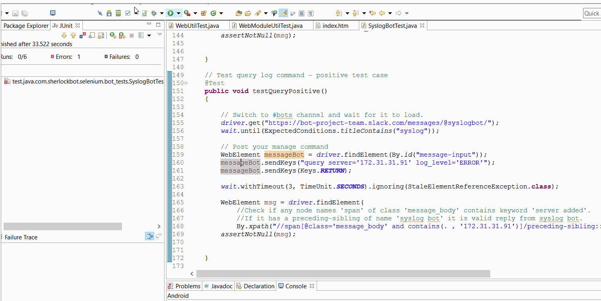

# Syslog Bot - Bot Milestone

## Team

<table>
<tr>
<td> Aparna Patil </td>
<td> akpatil </td>
</tr>
<tr>
<td> Jignesh Darji </td>
<td> jndarji </td>
</tr>
<tr>
<td> Prathamesh Ghanekar </td>
<td>  pghanek </td>
</tr>
<tr>
<td> Saurabh Sakpal </td>
<td> ssakpal </td>
</tr>
<tr>
<td> Sushant Tongaonkar </td>
<td>  stongao </td>
</tr>
</table>

## Use Cases
<b>Use Case 1: Add Server to user info database</b> 

- Preconditions 
	User must have slack bot token in system and set to "ALTCODETOKEN"
- Main Flow 
	User will write following command to add new server 
	@syslogbot manage add-server=<SERVER_NAME> ip=<IP_ADDRESS>
- Subflows 
	[S1] Bot will parse the message to find message type. If it's a command message, it will create the query to insert or delete a server [S2].  
	[S2] Bot will create and run a query to add the provided server to the DB  
- Alternative Flows 
	[E1] Error in adding server

<b>Use Case 2: Delete Server from user info database</b> 

- Preconditions 
	User must have slack bot token in system and set to "ALTCODETOKEN"
- Main Flow 
	User will write following command to delete new server 
	@syslogbot manage delete-server=<SERVER_NAME>
- Subflows 
	[S1] Bot will parse the message to find message type. Since it's a command message, it will create the query to insert or delete a server [S2]  
	[S2] Bot will create and run a query to delete the provided server to the DB  
- Alternative Flows 
	[E1] Error in deleting server

<b>Use Case 3: Query log database for</b> 

- Preconditions 
	User must have slack bot token in system and set to "ALTCODETOKEN" 
	User must have access to server availabl in user info database
- Main Flow 
	User will write following command to query logs 
	@syslogbot query server_ip=<IP_ADDRESS> loglevel=<LOG_LEVEL>
- Subflows 
	[S1] Bot will parse the message to find message type. Since it's a command message, it will create the query to insert or delete a server [S3]  
	[S3] Bot will create a DB query to pull logs from the servers specified  
- Alternative Flows 
	[E1] User does not have access to server 
	[E2] No logs in the database

## Mocking
For the bot milestone, we had to decouple the database access from the population of data. So for the purpose of mocking, we have created a mock database with columns as defined in the fields in the Design milestone.

## Bot Implementation
We have implemented basic interaction with the bot where the bot code performs the following functions:
- Parse the message to create structured message object
- Translate the object to a DB query message
- Query the DB for the required information or update the DB with required information

What the bot does?
- Bot can add and remote servers
- Bot can translate user high-level commands to query messages
- Bot can return the user the output of the required data
- Bot can provide sufficiently descriptive error messages

What the bot doesn't do yet?
- It doesn't connect to the servers to pull the logs
- It doesn't parse log messages to process them into structured DB
- It doesn't provide monitoring and summary functions

## Selenium testing of each use case

| TEST CASE ID                 | TEST CASE                                                                                                       | EXPECTED RESULT                                                      | ACTUAL RESULT                                                        | RESULT |
|------------------------------|-----------------------------------------------------------------------------------------------------------------|----------------------------------------------------------------------|----------------------------------------------------------------------|--------|
| SyslogBot.AddServer.Test1    | Add new server to user info database Valid Input:  @syslogbot manage add-server='my_web_server' ip='20.20.43.2' | Server added successfully.                                           | Server added successfully.                                           | PASS   |
| SyslogBot.AddServer.Test2    | Add new server to user info database Invalid Input:  @syslogbot manage add-server='my_web_server'               | Error adding server.                                                 | Error adding server.                                                 | PASS   |
| SyslogBot.DeleteServer.Test1 | Delete server from user info database Valid Input: @syslogbot manage delete-server='my_web_server'              | Server deleted successfully.                                         | Server deleted successfully.                                         | PASS   |
| SyslogBot.DeleteServer.Test2 | Delete server from user info database Invalid Input: @syslogbot manage delete-server='invalid_server_name'      | Error deleting server.                                               | Error deleting server.                                               | PASS   |
| SyslogBot.QueryLogsr.Test1   | Query logs from log database Valid Input: @syslogbot query server_ip="10.10.1.2" loglevel="ERROR"               | List of logs from log database with corresponding server ip address. | List of logs from log database with corresponding server ip address. | PASS   |
| SyslogBot.QueryLogsr.Test2   | Query logs from log database Invalid Input: @syslogbot query server_ip="10.10.1.2" loglevel="ABC"               | Invalid Input.                                                       | Invalid Input.                                                       | PASS   |

## Task Tracking - [Worksheet](WORKSHEET.md)
## Screencast ##
### Use Case 1: Adding a server

### Use Case 2: Deleting a server

### Use Case 3: Running query

### Testing

