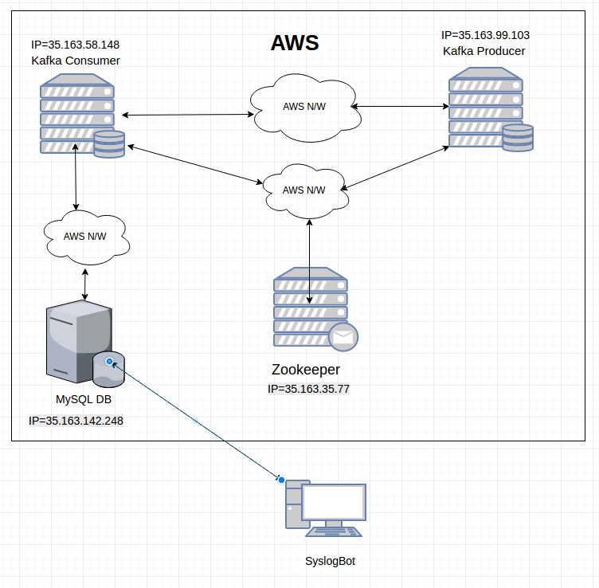
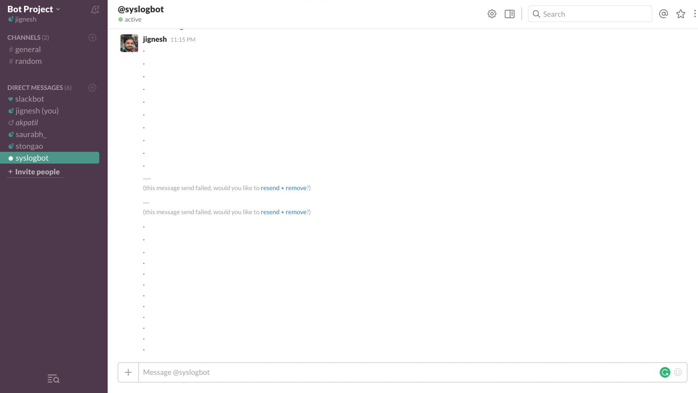
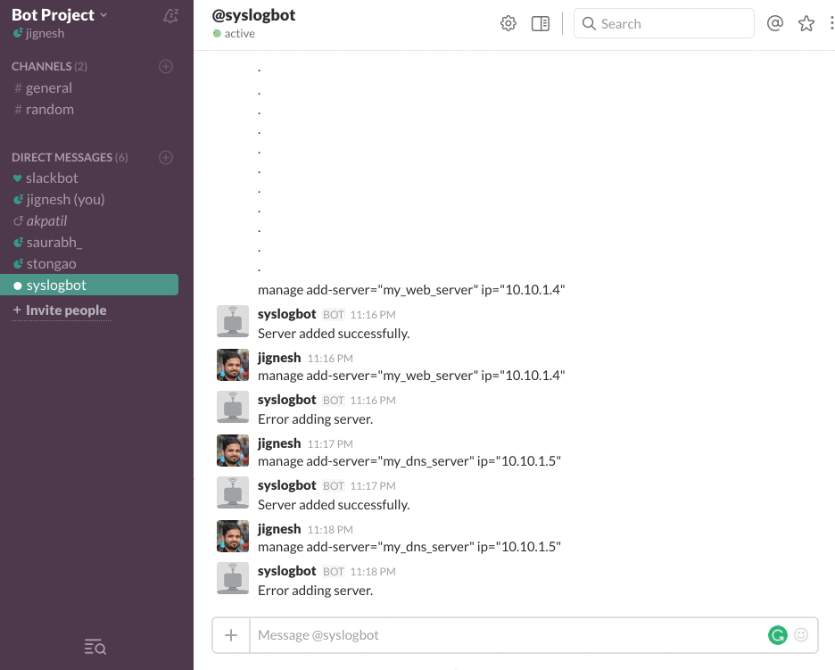
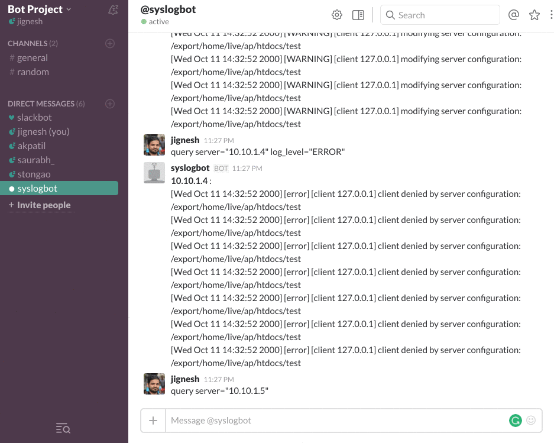

# Syslog Bot - Service Milestone

## Team

<table>
<tr>
<td> Aparna Patil </td>
<td> akpatil </td>
</tr>
<tr>
<td> Jignesh Darji </td>
<td> jndarji </td>
</tr>
<tr>
<td> Saurabh Sakpal </td>
<td> ssakpal </td>
</tr>
<tr>
<td> Sushant Tongaonkar </td>
<td>  stongao </td>
</tr>
</table>

## Use Cases
<b>Use Case 1: Add Server to user info database</b> 

- Preconditions 
	User must have slack bot token in system and set to "ALTCODETOKEN"
- Main Flow 
	User will write following command to add new server 
	@syslogbot manage add-server=<SERVER_NAME> ip=<IP_ADDRESS>
- Subflows 
	[S1] Bot will parse the message to find message type. If it's a command message, it will create the query to insert or delete a server [S2].  
	[S2] Bot will create and run a query to add the provided server to the DB  
- Alternative Flows 
	[E1] Error in adding server

<b>Use Case 2: Delete Server from user info database</b> 

- Preconditions 
	User must have slack bot token in system and set to "ALTCODETOKEN"
- Main Flow 
	User will write following command to delete new server 
	@syslogbot manage delete-server=<SERVER_NAME>
- Subflows 
	[S1] Bot will parse the message to find message type. Since it's a command message, it will create the query to insert or delete a server [S2]  
	[S2] Bot will create and run a query to delete the provided server to the DB  
- Alternative Flows 
	[E1] Error in deleting server

<b>Use Case 3: Query log database for</b> 

- Preconditions 
	User must have slack bot token in system and set to "ALTCODETOKEN" 
	User must have access to server availabl in user info database
- Main Flow 
	User will write following command to query logs 
	@syslogbot query server_ip=<IP_ADDRESS> loglevel=<LOG_LEVEL>
- Subflows 
	[S1] Bot will parse the message to find message type. Since it's a command message, it will create the query to insert or delete a server [S3]  
	[S3] Bot will create a DB query to pull logs from the servers specified  
- Alternative Flows 
	[E1] User does not have access to server 
	[E2] No logs in the database

## Service Implementation
We have implemented service to gather logs from servers and present to user via bot created in previous milestone. Following is the architecture diagram of service.

####Service performs following functions.
- Gathers data from different nodes and places it on messaging queue.
- Fetches data from messaging queue and inserts it into database
- The data from database is fetched by bot as requested by user.

What does service do?
- Service can read data from syslog of server and enqueue it on kafka messaging queue, running on an independent node.
- Service can insert syslog read from different nodes in database.
- Service can add server to userinfo database to store it with alias.

## Screencast ##
### Use Case 1: Adding a server

### Use Case 2: Deleting a server

### Use Case 3: Running query

