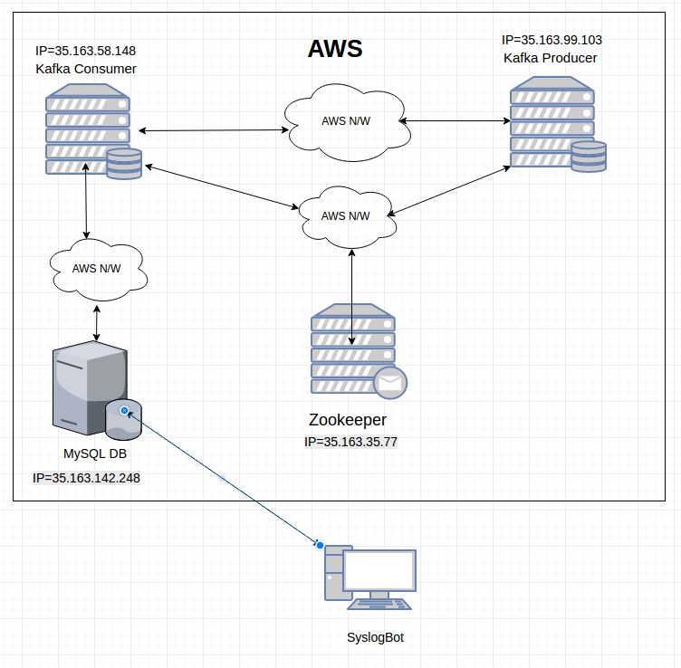

# Syslog Bot - Deploy Milestone


## Team 

<table>
<tr>
<td> Aparna Patil </td>
<td> akpatil </td>
</tr>
<tr>
<td> Jignesh Darji </td>
<td> jndarji </td>
</tr>
<tr>
<td> Saurabh Sakpal </td>
<td> ssakpal </td>
</tr>
<tr>
<td> Sushant Tongaonkar </td>
<td>  stongao </td>
</tr>
</table>

## Deployment
<b>Prerequisites</b><br>

- Clone bot repository<br>
	Bot repo url<br>
- Install ansible<br>
	pip install ansible<br>
- Install python boto library<br>
	pip install boto<br>
- Set up the AWS access and secret keys in the environment settings<br>
	Login to ASW account<br>
	Go to user > My Security Credentials<br>
	Create new access key<br>
	Copy Access Key ID and set up environment variable:<br>
	```export AWS_ACCESS_KEY_ID={{ AWS_ACCESS_KEY_ID }}```<br>
	Copy Secret Access Key and set up environment variable:<br>
	```export AWS_SECRET_ACCESS_KEY={{ AWS_SECRET_ACCESS_KEY }}```<br>

- Create /boto file and copy following contents to it:<br>
	```
	[Credentials]
	aws_access_key_id = {{ AWS_ACCESS_KEY_ID }}
	aws_secret_access_key = {{ AWS_SECRET_ACCESS_KEY }}
	```
- Create key-pair in AWS account<br>
	Create a Key-Pair with name 'syslogbot' for provisioning ec2 instances.<br>
	Download the .pem file and store it in /Bot/ansible folder<br>

<b>Deployment Scripts</b><br>

- Run script to set up aws instances<br>
	```ansible-playbook deploy.yml```
- Run scripts for configuring aws instances<br>
	```ansible-playbook connection.yml -i inventory```

## Service Implementation
We have implemented service to gather logs from servers and present to user via bot created in previous milestone. Following is the architecture diagram of service.

####Service performs following functions.
- Gathers data from different nodes and places it on messaging queue.
- Fetches data from messaging queue and inserts it into database
- The data from database is fetched by bot as requested by user.

## Screencast
### Use Case 1: Adding a server

### Use Case 2: Deleting a server

### Use Case 3: Running query

