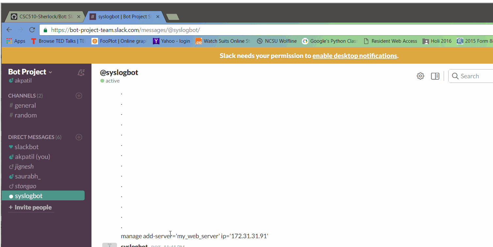
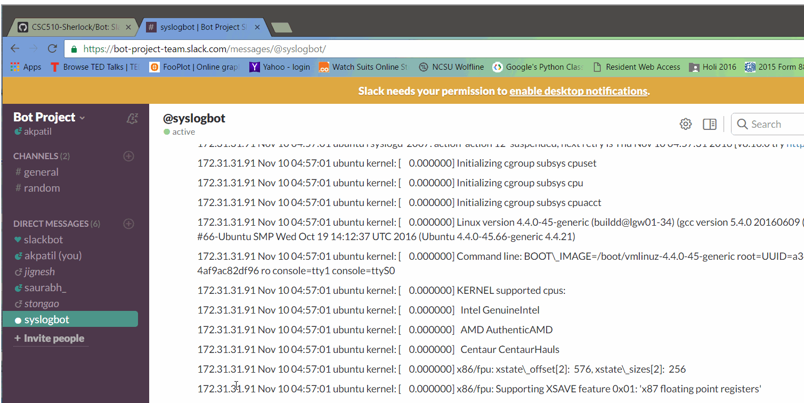
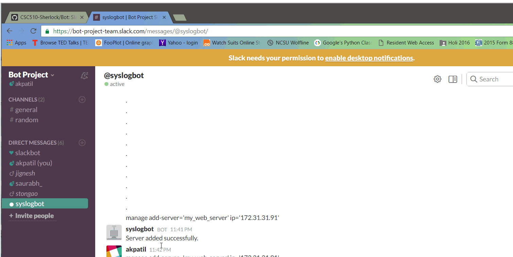

# Syslog Bot - Deploy Milestone


## Team 

<table>
<tr>
<td> Aparna Patil </td>
<td> akpatil </td>
</tr>
<tr>
<td> Jignesh Darji </td>
<td> jndarji </td>
</tr>
<tr>
<td> Saurabh Sakpal </td>
<td> ssakpal </td>
</tr>
<tr>
<td> Sushant Tongaonkar </td>
<td>  stongao </td>
</tr>
</table>

## Deployment - By provisioning AWS instances
<b>Prerequisites</b><br>

- Clone bot repository<br>
	git clone git@github.ncsu.edu:CSC510-Sherlock/Bot.git
- Install ansible<br>
	pip install ansible<br>
- Install python boto library<br>
	pip install boto<br>
- Set up the AWS access and secret keys in the environment settings<br>
	Login to ASW account<br>
	Go to user > My Security Credentials<br>
	Create new access key<br>
	Copy Access Key ID and set up environment variable:<br>
	```export AWS_ACCESS_KEY_ID={{ AWS_ACCESS_KEY_ID }}```<br>
	Copy Secret Access Key and set up environment variable:<br>
	```export AWS_SECRET_ACCESS_KEY={{ AWS_SECRET_ACCESS_KEY }}```<br>

- Create /boto file and copy following contents to it:<br>
	```
	[Credentials]
	aws_access_key_id = {{ AWS_ACCESS_KEY_ID }}
	aws_secret_access_key = {{ AWS_SECRET_ACCESS_KEY }}
	```
- Create key-pair in AWS account<br>
	Create a Key-Pair with name 'syslogbot' for provisioning ec2 instances.<br>
	Download the .pem file and store it in /Bot/ansible directory<br>

<b>Deployment Scripts</b><br>

- Run script to set up aws instances<br>
	```ansible-playbook deploy.yml```
- Run scripts for configuring aws instances<br>
	```ansible-playbook connection.yml -i inventory```

## Acceptance Testing Instruction

Run following test cases for acceptance testing:

| TEST CASE ID                 | TEST CASE                                                                                                       | EXPECTED RESULT                                                      | ACTUAL RESULT                                                        | RESULT |
|------------------------------|-----------------------------------------------------------------------------------------------------------------|----------------------------------------------------------------------|----------------------------------------------------------------------|--------|
| SyslogBot.AddServer.Test1    | Add new server to user info database Valid Input:  @syslogbot manage add-server='my_web_server' ip='20.20.43.2' | Server added successfully.                                           | Server added successfully.                                           | PASS   |
| SyslogBot.AddServer.Test2    | Add new server to user info database Invalid Input:  @syslogbot manage add-server='my_web_server'               | Error adding server.                                                 | Error adding server.                                                 | PASS   |
| SyslogBot.DeleteServer.Test1 | Delete server from user info database Valid Input: @syslogbot manage delete-server='my_web_server'              | Server deleted successfully.                                         | Server deleted successfully.                                         | PASS   |
| SyslogBot.DeleteServer.Test2 | Delete server from user info database Invalid Input: @syslogbot manage delete-server='invalid_server_name'      | Error deleting server.                                               | Error deleting server.                                               | PASS   |
| SyslogBot.QueryLogsr.Test1   | Query logs from log database Valid Input: @syslogbot query server_ip="10.10.1.2" loglevel="ERROR"               | List of logs from log database with corresponding server ip address. | List of logs from log database with corresponding server ip address. | PASS   |
| SyslogBot.QueryLogsr.Test2   | Query logs from log database Invalid Input: @syslogbot query server_ip="10.10.1.2" loglevel="ABC"               | Invalid Input.                                                       | Invalid Input.                                                       | PASS   |


## Screencast
### Use Case 1: Adding a server

### Use Case 2: Deleting a server

### Use Case 3: Running query

